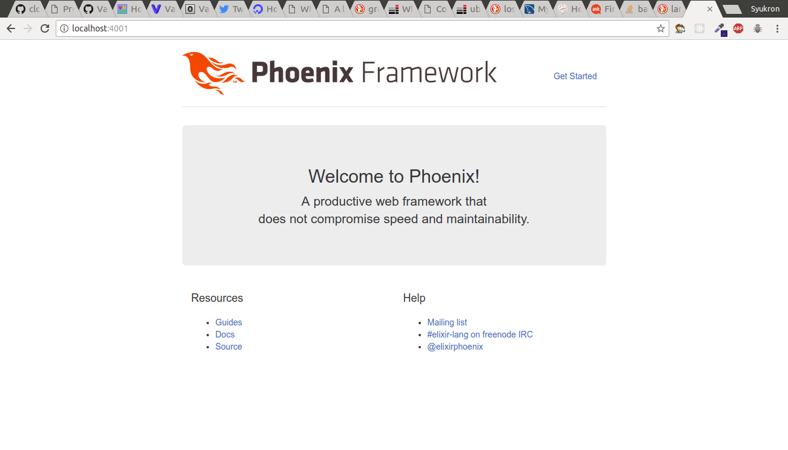

## Persiapan Box

Gunakan box `hashicorp/precise64`.
```rb
  config.vm.box = "hashicorp/precise64"
```

Forward port 4000 ke 4001
```rb
  config.vm.network "forwarded_port", guest: 4000, host: 4001, host_ip: "127.0.0.1"
```

Ganti metode provisioning
```rb
  config.vm.provision "shell", path: "provision.sh"
```


## Provisioning

Buat file `provision.sh` dan isikan script dibawah

Download dan install paket yang diperlukan
```bash
cd ~
wget https://packages.erlang-solutions.com/erlang-solutions_1.0_all.deb
sudo dpkg -i erlang-solutions_1.0_all.deb
sudo apt-get update
sudo apt-get install -y esl-erlang elixir
```


Export locale
```bash
export LC_ALL=en_US.UTF-8
export LANG=en_US.UTF-8
export LANGUAGE=en_US.UTF-8
```

Instalasi Phoenix Framework
```bash
echo -e "Y\n" | mix local.hex
echo -e "Y\n" | mix archive.install https://github.com/phoenixframework/archives/raw/master/phx_new-1.3.0.ez
```

Buat dan jalankan test server elixir
```bash
echo -e "Y\nY\n" | mix phx.new --no-ecto --no-brunch testserver
cd ~/testserver
mix local.rebar --force 
echo "Y\n" | mix phx.server &
```

## Deploy

```bash
$ vagrant up --provision
```

## Hasil
Test server bisa dilihat dengan membuka http://localhost:4001 pada browser host



