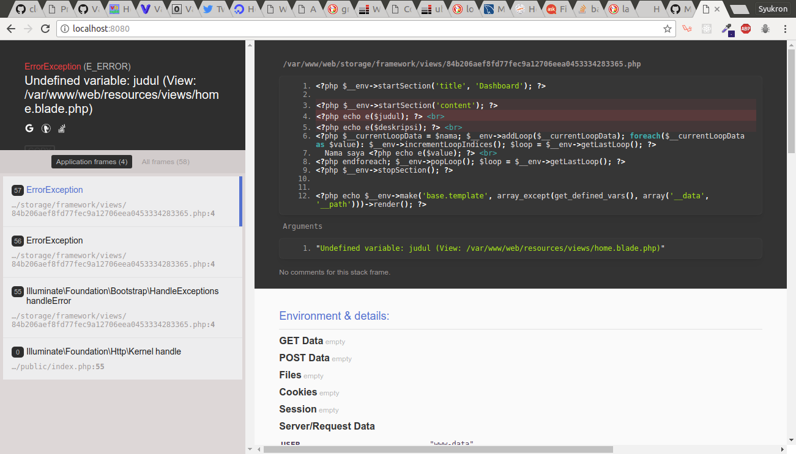

## Persiapan Box

Kami menggunakan box dari ubuntu 16.04 (link https://cloud-images.ubuntu.com/xenial/current/xenial-server-cloudimg-amd64-vagrant.box).

```bash
$ vagrant box add xenial64 /path/to/xenial-server-cloudimg-amd64-vagrant.box
```

## Persiapan Vagrantfile
Edit Vagrantfile

Set Box
```rb
  config.vm.box = "xenial64"
```

Forward port
```rb
  config.vm.network "forwarded_port", guest: 80, host: 8080
  config.vm.network "forwarded_port", guest: 3306, host: 6969
```

Sinkronisasi folder
```rb
  config.vm.synced_folder "./pelatihan-laravel", "/var/www/web",  id: "vagrant-root",
    owner: "vagrant",
    group: "www-data",
    mount_options: ["dmode=775,fmode=664"]
```

Siapkan script provisioning `provision.sh`.
```rb
  config.vm.provision "shell", path: "provision.sh"
```

## Script Provisioning
Buat file `provision.sh` dan tambahkan script-script dibawah pada file tersebut.

### Install PHP7.1
```bash
add-apt-repository ppa:ondrej/php
apt-get update
apt-get install -y python-software-properties software-properties-common

apt-get install -y php7.1 php7.1-fpm
apt-get install -y php7.1-mysql
apt-get install -y mcrypt php7.1-mcrypt
apt-get install -y php7.1-cli php7.1-curl php7.1-mbstring php7.1-xml php7.1-mysql
apt-get install -y php7.1-json php7.1-cgi php7.1-gd php-imagick php7.1-bz2 php7.1-zip

```

### Install MySQL
Buat user `root` password `password`.
```bash
sudo debconf-set-selections <<< 'mysql-server-5.6 mysql-server/root_password password password'
sudo debconf-set-selections <<< 'mysql-server-5.6 mysql-server/root_password_again password password'
```

Install paket
```bash
apt-get install -y mysql-server mysql-client mysql-common
```

Buat database `bdq` dan hak akses
```bash
mysql -uroot -ppassword -e "CREATE DATABASE IF NOT EXISTS dbq;";
mysql -uroot -ppassword -e "GRANT ALL PRIVILEGES ON *.* TO 'root'@'%' IDENTIFIED BY 'password';"
mysql -uroot -ppassword -e "GRANT ALL PRIVILEGES ON *.* TO 'root'@'localhost' IDENTIFIED BY 'password';"

sudo service mysql restart
```

### Install nginx
Install paket
```bash
apt-get install -y nginx
```

Replace konfigurasi default
```
echo '' > /etc/nginx/sites-available/default
cat >> /etc/nginx/sites-available/default <<'EOF'
server {
	# Server listening port
	listen 80;

	# Server domain or IP
	server_name localhost;

	# Root and index files
	root /var/www/web/public;
	index index.php index.html index.htm;	

	# Urls to attempt
	location / {
                try_files $uri $uri/ /index.php?$query_string;
        }

	# Configure PHP FPM
	location ~* \.php$ {
		fastcgi_pass unix:/var/run/php/php7.1-fpm.sock;
		fastcgi_index index.php;
		fastcgi_split_path_info ^(.+\.php)(.*)$;
		fastcgi_param SCRIPT_FILENAME $document_root$fastcgi_script_name;
		include /etc/nginx/fastcgi_params;
	}

	# Debugging
	access_log /var/log/nginx/localhost_access.log;
	error_log /var/log/nginx/localhost_error.log;
	rewrite_log on;
}
EOF
```

Restart service-servicenya
```bash
service nginx restart
service php7.1-fpm restart
```

## Install Composer
```bash
curl -s https://getcomposer.org/installer | php
mv composer.phar /usr/local/bin/composer
```

## Setup Laravel
```bash
cd /var/www/web
cp .env.example .env

php artisan key:generate

sed -i "s/DB_DATABASE=blog/DB_DATABASE=dbq/g" .env
sed -i "s/DB_USERNAME=root/DB_USERNAME=root/g" .env
sed -i "s/DB_PASSWORD=/DB_PASSWORD=password/g" .env

composer install

php artisan migrate
```

## Setup MySQL
Atur MySQL untuk _remote connection_.
```bash
sed -i '43s/.*/bind-address  = 0.0.0.0/' /etc/mysql/mysql.conf.d/mysqld.cnf
service mysql restart
```

## Deploy
```bash
$ git clone https://github.com/fathoniadi/pelatihan-laravel.git
$ vagrant up --provision
```

## Hasil
Test server bisa dilihat dengan membuka http://localhost:8080 pada browser host



Koneksi dengan mysql dapat dilakukan dengan
```bash
$ mysql --host [IP_HOST] --port 6969 -uroot -p
```
