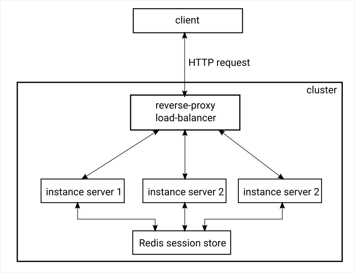

# Tugas 2

## Soal
Analisa apa perbedaan antara ketiga algoritma tersebut.

## Jawab
Pertama, algoritma _round robin_ menggunakan pendistribusikan beban sama rata. Setiap _worker_ mendapatkan beban yang sama dan kemampuan dari setiap _worker_ tidak diperhitungkan.

Kedua, metode IP-hash. Metode ini menggunakan pendistribusian beban berdasarkan alamat IP dari _client_. _Request_ dari _client_ yang memiliki IP yang sama dilayani oleh _worker_ yang sama.

Ketika, metode least-connected. Metode ini memperhitungkan jumlah _requst_ yang masih dilayani dari _worker_. _Load balancer_ memberikan _request_ yang masuk kepada _worker_ yang memiliki jumlah _request_ yang paling sedikit.

---

## Soal
Biasanya pada saat membuat website, data user yang sedang login disimpan pada session. Sesision secara default tersimpan pada memory pada sebuah host. Bagaimana cara mengatasi masalah session ketika kita melakukan load balancing?

## Jawab
Permasalahan tersebut dapat diselesaikan dengan dua cara.

Pertama, pembuatan load-balancer dengan menggunakan metode __IP-Hash__ sebagai algoritma pembagian beban. Setiap IP akan dilayani oleh salah satu worker tertentu dan tidak 

Kedua, pembuatan layanan ___session store___ sendiri. Contoh layanan yang tepat untuk mengatasi permasalahan ini adalah penggunaan [Redis](https://redis.io/) sebagai _session store_. 

Berikut ilustrasi arsitekturnya.

