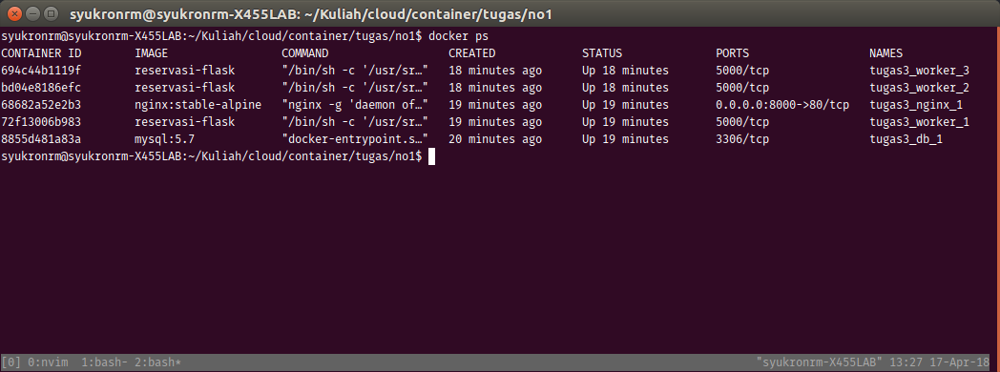
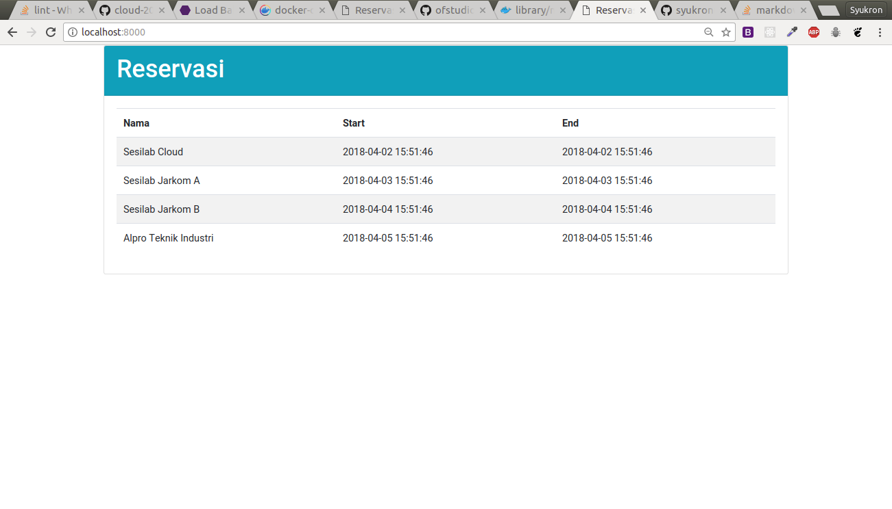
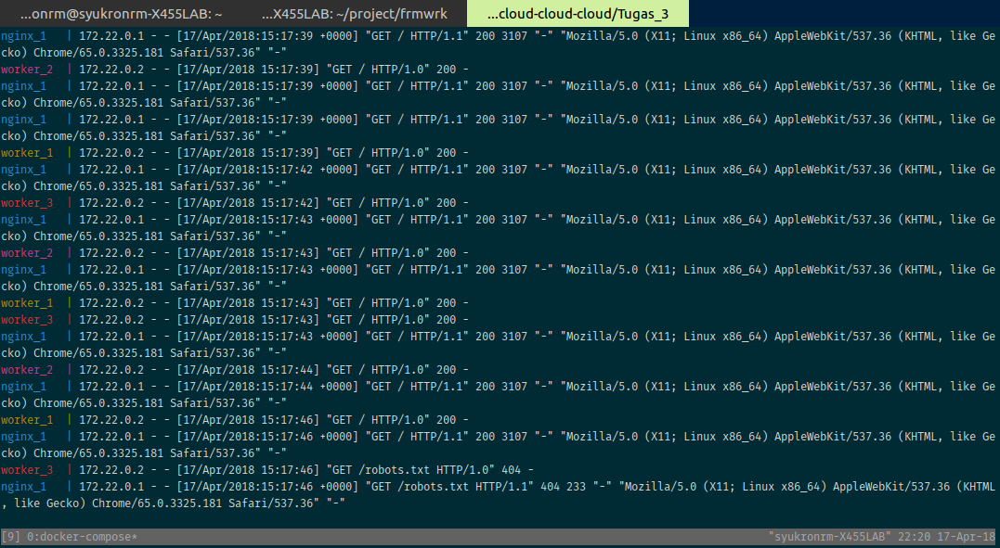

# Tugas 3

Membuat dockerfile untuk soal nomor 1.

1. Buat folder dan download dulu

   ```bash
   $ mkdir Tugas_3; cd Tugas_3
   $ wget https://cloud.fathoniadi.my.id/reservasi.zip
   $ unzip reservasi.zip
   ```

2. Buat Dockerfile untuk reservasi tersebut
   ```bash
   $ vim Dockerfile
   ```
   ```dockerfile
   FROM ubuntu:16.04
   RUN echo 'deb http://archive.ubuntu.com/ubuntu xenial universe' | tee -a /etc/apt/sources.list
   RUN apt-get update
   RUN apt-get install -y python python-virtualenv libmysqlclient-dev
   RUN apt-get install -y git
   RUN apt-get install -y python-dev
   RUN apt-get install -y build-essential autoconf libtool pkg-config

   RUN mkdir -p /usr/src/app
   RUN virtualenv /usr/src/app/env
   COPY ./reservasi /usr/src/app
   RUN /usr/src/app/env/bin/pip install -r /usr/src/app/req.txt
   ENTRYPOINT /usr/src/app/env/bin/python /usr/src/app/server.py
   ```

   Buat image dengan nama `reservasi-flask`
   ```bash
   $ docker build -t reservasi-flask .
   ```

3. Membuat `docker-compose.yml`. Disini kami tidak menggunakan static worker, tapi kami menggunakan fitur __scale__ yang terdapat pada docker-compose CLI. Fitur scaling ini akan dijelaskan pada nomor berikutnya.
   ```yml
   version: '3.4'
   services:
       db:
           image: mysql:5.7
           volumes:
               - ./reservasi:/docker-entrypoint-initdb.d
               - dbdata:/var/lib/mysql
           restart: always
           environment:
               MYSQL_ROOT_PASSWORD: buayakecil
               MYSQL_DATABASE: reservasi
               MYSQL_USER: userawan
               MYSQL_PASSWORD: buayakecil
       worker:
           image: reservasi-flask
           depends_on:
               - db
           environment:
               DB_HOST: db
               DB_USERNAME: userawan
               DB_PASSWORD: buayakecil
               DB_NAME: reservasi
       nginx:
           image: nginx:stable-alpine
           ports:
               - 8000:80
           depends_on:
               - worker
           volumes:
               - ./nginx.conf:/etc/nginx/conf.d/default.conf:ro
   volumes:
      dbdata:
   ```

   Penjelasan:
   Pertama, pada service `db`, kami menggunakan mysql:5.7 dan menggunakan fitur otomatis import pada folder  `/docker-entrypoint-initdb.d`. Dan menggunakan volume yang kami namai `dbdata`.

   Kedua, worker menggunakan _image_ yang telah dibuat pada poin sebelumnya.

   Ketiga, load balancer menggunakan konfigurasi berikut untuk `nginx.conf`

   ```
   server {
     listen  80 default_server;
     location / {
       proxy_pass http://worker:80;
     }
   }
   ```

   Setelah itu jalankan

   ```
   $ docker-compose up -d
   ```

   Tunggu beberapa saat agar semua servicenya berjalan sempurna

4. Terakhir untuk scaling, kami menggunakan scale yang terdapat pada `docker-compose`. Jalankan

   ```bash
   $ docker-compose scale worker=3
   ```

   Berikut daftar container setalah dilakukan scaling

   

5. Restart service load-balancer (nginx) agar dapat mengenali `worker_2` dan `worker_3`

   ```
   $ docker-compose restart nginx
   ```

6. Tampilan web dan load-balancing

   Berikut tampilan halaman utama web
   

   Load balancing menggunakan metode *round robin*
   
